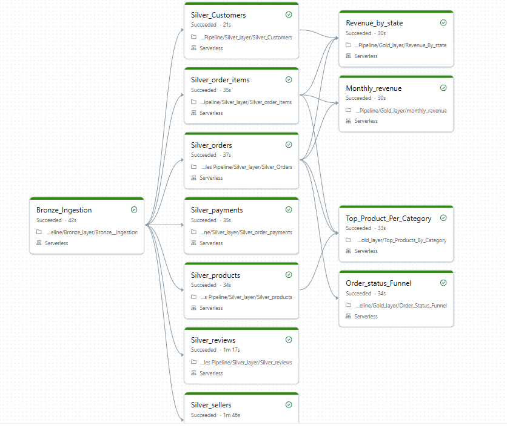

# retail-sales-lakehouse

A medallion architecture lakehouse built on Databricks using the Olist Brazilian E-Commerce dataset. The project shows end-to-end data engineering work — from raw CSV ingestion to business-facing aggregated tables.

## What This Project Shows

* End-to-end medallion pipeline — raw CSV ingestion, cleaning and standardisation, and final aggregations for reporting
* Reusable data quality framework — 6 functions split into gates (raise on failure) and labellers (mark rows without raising)
* Quarantine flow — invalid rows are moved to a separate schema with reasons, instead of being dropped silently
* Four different aggregation patterns in Gold — time-based grouping, window functions (DENSE_RANK), multi-table joins, and conditional aggregation using CASE WHEN
* Design decisions documented in each notebook — why each choice was made, not just what was done
* Pipeline orchestrated as a Databricks Job — DAG with Bronze → Silver (parallel) → Gold dependencies, running end-to-end on Serverless
  


## Architecture: Bronze → Silver → Gold

* **Bronze** — config-driven ingestion of 9 source tables with explicit schemas, lineage columns, and per-table error handling. Uses overwrite mode for idempotent re-runs.
* **Silver** — cleans the data, removes duplicates, and applies the DQ framework. Two tables (orders and order_payments) move invalid rows to a separate `quarantine` schema with reasons. One table (products) joins to a category translation lookup with a fallback for missing values.
* **Gold** — four tables for business reporting: monthly revenue, top products per category (window function), revenue by state (multi-table join), and order status funnel (conditional aggregation).


## Data Quality Framework

A reusable module (`notebooks/utilities/silver_dq_checks.ipynb`) has the following functions:

* **Gates** (raise on failure, stop the pipeline): `check_not_null`, `check_unique`, `check_row_count`, `check_event_sequence`, `check_value_range`
* **Labellers** (mark rows for routing, do not raise): `identify_event_sequence_violations`

Every Silver table runs DQ checks before writing. After a quarantine split, the gates also run on the clean DataFrame as a final check.

## Dataset

**Source:** [Olist Brazilian E-Commerce Public Dataset](https://www.kaggle.com/datasets/olistbr/brazilian-ecommerce)

The dataset is not included in this repository. To run the pipeline:

1. Download the 9 CSV files from the Kaggle link
2. Upload them to a Unity Catalog Volume at `/Volumes/retail_lakehouse/bronze/retail_data/`

## Tech Stack

* Databricks (Free Edition with Serverless)
* PySpark and Spark SQL
* Delta Lake
* Unity Catalog (4 schemas: bronze, silver, gold, quarantine)

## Setup

Before running the pipeline notebooks for the first time:

1. Run `notebooks/setup/00_create_catalog_schemas.ipynb` once to create the catalog and the four schemas.
2. Upload the Olist CSV files to the Bronze Volume as mentioned above.

Then run the notebooks in this order: Bronze → Silver → Gold.

## Pipeline Orchestration

The pipeline runs as a Databricks Job with the following dependency graph:

- **Bronze ingestion** runs first (single task, reads CSVs into Bronze Delta tables)
- **7 Silver tables** run in parallel after Bronze completes (independent of each other)
- **4 Gold tables** run after their Silver dependencies (most depend on multiple Silver tables)

Total end-to-end runtime: ~2 minutes on Serverless compute.

## Project Status

* Bronze — complete ✓ (9 tables, config-driven ingestion)
* Silver — complete ✓ (7 tables; sellers and geolocation deferred — see design decisions below)
* Gold — complete ✓ (4 tables across 4 patterns)

## Design Decisions and Known Limitations

* **`silver.geolocation` was not built** — the source table has many rows per zip code, which would cause row fan-out on join. The Gold tables do not need lat/long, so building this table would add complexity without any real benefit. This is a deliberate scope decision.
* **Freight value calculation in Gold revenue tables** — revenue is calculated as `SUM(price + freight_value)` across all `order_items` rows. Each row is treated as a distinct unit, and its `price` and `freight_value` are both summed at the row level. This is documented in each Gold notebook header.
* **Batch pipeline only** — overwrite mode is used everywhere, which is correct for a full-snapshot source. A future version with Autoloader for incremental ingestion and MERGE for upserts would be the natural next step.

```
retail-sales-lakehouse/
├── README.md
├── .gitignore
└── notebooks/
    ├── setup/
    │   └── 00_create_catalog_schemas.ipynb
    ├── utilities/
    │   └── silver_dq_checks.ipynb
    ├── bronze/
    │   └── Bronze__Ingestion.ipynb
    ├── silver/
    │   ├── Silver_Customers.ipynb
    │   ├── Silver_Orders.ipynb
    │   ├── Silver_order_items.ipynb
    │   ├── Silver_order_payments.ipynb
    │   ├── Silver_products.ipynb
    │   ├── Silver_reviews.ipynb
    │   └── Silver_sellers.ipynb
    └── gold/
        ├── monthly_revenue.ipynb
        ├── Top_Products_By_Category.ipynb
        ├── Revenue_By_State.ipynb
        └── Order_Status_Funnel.ipynb
```


        
